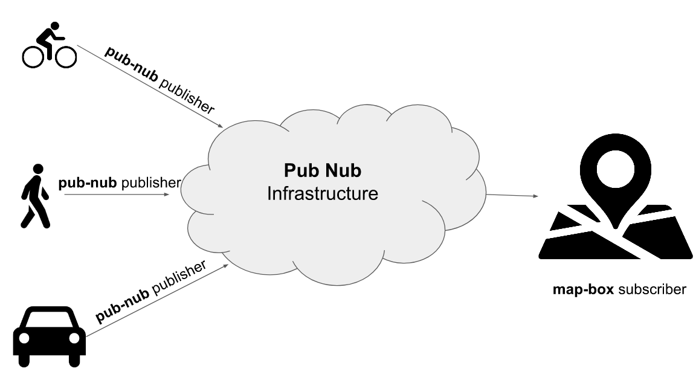

# Route Generator

This program, wrote in Node Js, uses Map Box API for generating routes from one location to another, and Pub-Nub infrastructure to publish those routes to connected clients channel.

